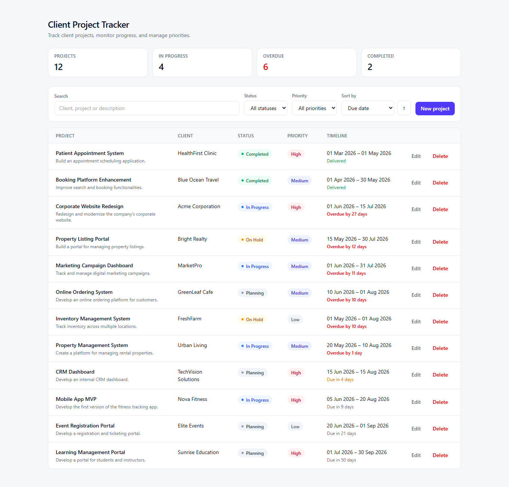
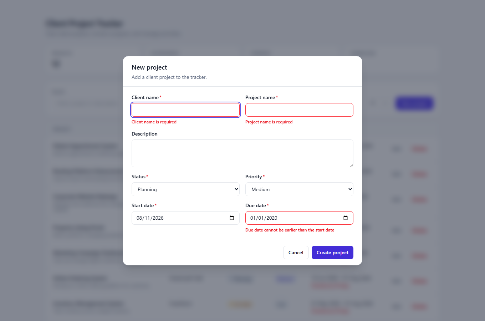
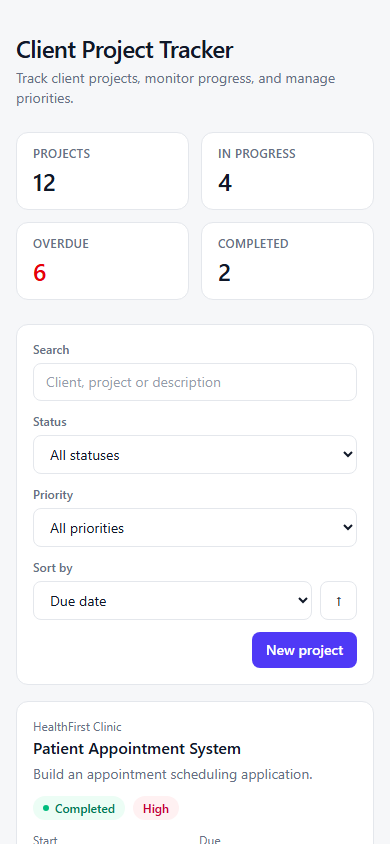

# Client Project Tracker

A project tracker for a digital agency: create, view, update and delete client projects, and see at a glance which ones are slipping.

Built for the Full Stack Developer Technical Assessment. The original brief is preserved in [docs/ASSESSMENT.md](docs/ASSESSMENT.md) and [REQUIREMENTS.md](REQUIREMENTS.md).



---

## Setup instructions

Requires **Node.js 20 or newer** (developed on 22.20). No database server to install — the app uses SQLite.

```bash
npm install     # install dependencies
npm run setup   # generate the Prisma client, create the database, seed test_data.json
npm run dev     # http://localhost:3000
```

That's it. `npm run setup` seeds the 12 projects from `test_data.json`, so the app has data the moment it opens.

### Other commands

| Command | What it does |
| --- | --- |
| `npm run dev` | Development server on port 3000 |
| `npm run build` / `npm start` | Production build and serve |
| `npm test` | Run the test suite (50 tests) |
| `npm run test:watch` | Tests in watch mode |
| `npm run lint` | ESLint |
| `npm run typecheck` | TypeScript, no emit |
| `npm run db:seed` | Re-seed the database from `test_data.json` |

Re-running `npm run setup` at any point resets the data to a clean state.

---

## Features implemented

**Required**

- Full REST API: list, read, create, update, delete
- Project list, create, edit and delete in the UI
- All six validation rules from the brief, enforced on the server and mirrored in the form
- Meaningful errors with correct status codes and per-field messages

**Bonus, and why these ones**

- **Search** across client name, project name and description
- **Filter** by status and by priority
- **Sort** by due date, start date, priority, project or client name, or recently added
- **Unit tests** — 50 tests covering validation, business rules and derived display logic

Search, filtering and sorting share the same query pipeline, so they cost very little once the list endpoint accepts a validated query object. Tests were included because the rubric weights correctness and maintainability heavily.

**Deliberately left out:** authentication, Docker and deployment. The brief states omissions are not penalised, and each of these would have meant either a shallow version (a fake login, an untested Dockerfile) or spending the time budget on infrastructure instead of the code being assessed. Adding auth is discussed under [What I would do next](#what-i-would-do-next).

Two extras that aren't in the brief but that a project manager would immediately miss: an **overdue indicator** on every project, and a **summary strip** counting total, in-progress, overdue and completed work. The list is where a PM starts their day; a due date with no sense of urgency attached is just a number.

---

## Tech stack

| Layer | Choice | Why |
| --- | --- | --- |
| Framework | **Next.js 16** (App Router) | Frontend and API in one codebase, one command to run, one deployment |
| Language | **TypeScript** (strict) | The same types describe the database row, the API response and the form |
| Database | **SQLite** via **Prisma 6** | Zero setup for whoever runs this; Prisma keeps the swap to Postgres to a two-line change |
| Validation | **Zod** | Schemas are shared by the API and the form, so the two cannot drift |
| Forms | **react-hook-form** | Minimal re-renders, and it accepts the Zod schema directly |
| Styling | **Tailwind CSS 4** | Fast, consistent, no separate stylesheet to keep in sync |
| Tests | **Vitest** | Fast, and native to the TypeScript/ESM setup |

The single biggest reason for a full-stack TypeScript framework here is the shared validation schema. In a split stack, the rule *"due date cannot be earlier than start date"* is written twice — once in the API, once in the form — and drifts the first time someone changes it. Here it is written once, in [`src/lib/validation/project.ts`](src/lib/validation/project.ts), and used by both.

---

## Project structure

```
src/
├── app/
│   ├── api/projects/
│   │   ├── route.ts             GET (list), POST (create)
│   │   └── [id]/route.ts        GET, PUT, DELETE
│   ├── layout.tsx
│   └── page.tsx                 renders the projects screen
│
├── components/
│   ├── projects/                projects-page, list, toolbar, form + delete dialogs
│   └── ui/                      button, badge, modal, form-field, toast
│
├── hooks/                       use-projects (data loading), use-debounced-value
│
└── lib/
    ├── validation/project.ts    the contract: fields, enums, rules  ← single source of truth
    ├── services/                business rules, transport-agnostic
    ├── repositories/            persistence boundary (interface + Prisma implementation)
    ├── http/                    error types and the response envelope
    ├── api-client.ts            typed browser client for the API
    ├── project-insights.ts      derived display logic (overdue, summary counts)
    ├── dates.ts                 calendar-date handling
    ├── types.ts                 the API-facing Project shape
    └── db.ts                    Prisma client singleton

prisma/            schema.prisma, seed.ts
tests/             validation, service and insights suites
```

### How a request flows

```
Route handler  →  Service            →  Repository        →  Prisma / SQLite
(HTTP only)       (validation +         (interface;
                   business rules)       swappable)
```

Each layer has one job, and the dependencies only point one way:

- **Route handlers** parse the request and format the response. Every one is under five lines. They contain no rules, so there is nowhere for logic to hide.
- **The service** validates input and enforces rules. It knows nothing about HTTP — it throws typed errors such as `ProjectNotFoundError` and lets the transport layer decide that this means 404. The same service would work behind a CLI or a queue consumer.
- **The repository** is an interface. The service depends on `ProjectRepository`, never on Prisma. This is what lets the entire service test suite run against an in-memory implementation with no database at all — and it is the same seam you would use to move to Postgres.

---

## API

Base path is `/api/projects`. The paths from the brief (`/projects`, `/projects/:id`) are also served, via rewrites in [`next.config.ts`](next.config.ts) — same handlers, no duplicated code.

| Method | Path | Purpose | Success |
| --- | --- | --- | --- |
| `GET` | `/api/projects` | List projects | `200` |
| `GET` | `/api/projects/:id` | Fetch one project | `200` |
| `POST` | `/api/projects` | Create a project | `201` |
| `PUT` | `/api/projects/:id` | Replace a project | `200` |
| `DELETE` | `/api/projects/:id` | Delete a project | `204` |

### Query parameters on `GET /api/projects`

| Parameter | Values | Default |
| --- | --- | --- |
| `search` | Free text; matches client name, project name or description | — |
| `status` | `Planning`, `In Progress`, `On Hold`, `Completed` | all |
| `priority` | `Low`, `Medium`, `High` | all |
| `sort` | `dueDate`, `startDate`, `priority`, `projectName`, `clientName`, `createdAt` | `dueDate` |
| `order` | `asc`, `desc` | `asc` |

Unknown sort fields are rejected rather than ignored, so a typo surfaces as an error instead of silently changing the order. Sorting by `priority` orders by severity — High, Medium, Low — not alphabetically.

### Response envelope

Every response has the same shape, so a client needs one handler rather than one per endpoint.

Success:

```json
{ "data": { "id": 1, "clientName": "Acme Corporation", "...": "..." } }
```

Failure:

```json
{
  "error": {
    "code": "VALIDATION_ERROR",
    "message": "The submitted data is invalid.",
    "fieldErrors": {
      "clientName": ["Client name is required"],
      "dueDate": ["Due date cannot be earlier than the start date"]
    }
  }
}
```

`fieldErrors` is keyed by form field name, which is exactly what the create/edit dialog needs to attach each message to the right input.

### Status codes

| Code | When |
| --- | --- |
| `400` | The request could not be understood — malformed JSON |
| `404` | The project id does not exist |
| `422` | The request was well-formed but broke a validation rule |
| `500` | Unexpected server fault; details are logged, never returned |

`400` and `422` are distinguished on purpose: *"I could not read what you sent"* and *"I read it and it is wrong"* call for different fixes on the client side.

### Try it

```bash
# List, filtered and sorted
curl "http://localhost:3000/api/projects?status=In%20Progress&sort=priority&order=desc"

# Create
curl -X POST http://localhost:3000/api/projects \
  -H 'Content-Type: application/json' \
  -d '{"clientName":"Northwind","projectName":"Supplier Portal","description":"Supplier onboarding.","status":"Planning","priority":"High","startDate":"2026-09-01","dueDate":"2026-11-30"}'

# Rejected: due date before start date
curl -X POST http://localhost:3000/api/projects \
  -H 'Content-Type: application/json' \
  -d '{"clientName":"Acme","projectName":"Test","status":"Planning","priority":"Low","startDate":"2026-07-15","dueDate":"2026-06-01"}'
```

---

## Validation

| Rule | Behaviour |
| --- | --- |
| Client name required | Rejected when missing, empty, or only whitespace |
| Project name required | Same |
| Status valid | Must be one of the four values; the error message lists them |
| Priority valid | Must be one of the three values; the error message lists them |
| Due date ≥ start date | Reported against the `dueDate` field, where the user can act on it |
| Meaningful errors | Field-keyed messages written for a person, not a stack trace |

Beyond the brief: dates must be real calendar dates (`2026-02-30` is rejected, not silently rolled over to March), text fields are trimmed and length-capped, and unknown keys are stripped so a client cannot set its own `id`.

**Every invalid field is reported at once** rather than one at a time, so the form can show every problem in a single pass.

One deliberate nuance: the cross-field date rule only runs once the individual fields are themselves valid — Zod does not run object-level refinements over a failed object. In practice you see the field errors first, then the date-order error once those are fixed. This is progressive rather than incomplete, and it is covered by tests either way.



---

## Assumptions made

The brief leaves some things open. Where it did, I chose deliberately rather than guessing silently — each of these would be a question for the product owner on a real project.

**Scope**

- **Single-user, no authentication.** There are no accounts, so anyone who opens the app sees and edits every project. I assumed an internal agency tool sitting behind an existing network or SSO boundary. Multi-tenancy would change the data model, so it is called out rather than half-built.
- **`REQUIREMENTS.md` outranks the brief.** It carries the data model, endpoints and validation rules, so where it and `docs/ASSESSMENT.md` disagree, I followed it. See [the closing note](#a-note-on-the-brief).
- **`test_data.json` is the intended seed data**, and its integer ids are worth preserving so documented examples such as `GET /api/projects/1` match what is actually in the database.

**Data model**

- **Status and Priority are fixed sets**, defined by the brief rather than editable by users. Making them configurable would mean two more tables and a management screen.
- **All fields except Description are required.** The brief only names Client Name and Project Name explicitly, but a project tracker with a missing status, priority or due date cannot do its job — so those are required too. Description is genuinely optional and defaults to an empty string.
- **Dates are calendar dates, not timestamps.** No time of day, and no per-user timezone: 1 June is 1 June wherever you open the app.
- **A due date in the past is allowed.** Only *due before start* is rejected. Forbidding past dates would make it impossible to enter a project that is already running or overdue — which is exactly the situation a tracker exists to surface.

**Behaviour**

- **Delete is permanent.** No soft delete or archive, so the confirmation dialog is the only safety net. A production tool would almost certainly archive instead, to keep history for reporting.
- **The dataset is small.** An agency tracks tens or hundreds of projects, so the list endpoint returns everything and pagination is deferred rather than built.
- **`PUT` replaces the whole resource**, since the brief specifies `PUT` and not `PATCH`. A partial body is rejected rather than merged.

## Notable decisions

**Validation lives in the service, not the route handler.** If it lived in the handler, the rules would only hold for HTTP callers. In the service they hold for every caller — including the seed script, which validates `test_data.json` against the same schema and fails loudly on a bad record rather than letting it reach the UI.

**The UI consumes the public API rather than reading the database directly.** A server component could query Prisma directly and skip the network hop. Going through the API instead means one data path to reason about, and every interaction in the app exercises the same endpoints an external client would use — the API cannot quietly rot.

**Dates are calendar dates, not instants.** A due date of 1 June is 1 June in every timezone. Values are normalised to UTC midnight on the way in and rendered as `YYYY-MM-DD` on the way out, so nothing shifts by a day depending on where the server runs. Display formatting is done by hand rather than through `Intl`, whose month abbreviations vary by locale and ICU version — "Sept" next to "Jul" in the same column reads as a bug.

**Priority has a derived sort key.** Ordering by the priority string alphabetically gives High, Low, Medium, which looks broken. The database stores a `priorityRank` (1/2/3) maintained by the repository, so the sort happens in the database and is correct.

**PUT is a full replacement.** A partial body is rejected rather than merged, which is what PUT means. A `PATCH` endpoint would be the right way to add partial updates.

**Integer ids.** They match `test_data.json`, so the documented examples line up with the seeded data. For a system with multiple writers or public-facing ids, UUIDs would be the safer default.

**Dialogs are mounted only while open.** Their state is created fresh each time one opens, so nothing has to be reset between editing one project and creating another — a class of stale-form bug removed by structure rather than by an effect.

**`.env` is committed.** It contains the SQLite path and nothing else. No secrets, and setup stays a single command. Machine-specific overrides go in `.env.local`, which is ignored.

---

## Testing

```bash
npm test
```

50 tests across three suites:

- **`tests/validation.test.ts`** — every rule from the brief, plus whitespace-only input, impossible calendar dates, wrong date formats, multi-error reporting, and unknown-key stripping.
- **`tests/project-service.test.ts`** — create/read/update/delete behaviour, not-found handling, ids arriving as strings from the URL, search and filter results, severity-ordered sorting, and rejection of partial `PUT` bodies.
- **`tests/project-insights.test.ts`** — overdue and due-soon logic, summary counts, and date parsing/formatting.

The service suite runs against `InMemoryProjectRepository` — no database, no fixtures to clean up, and it runs in milliseconds. That is the concrete payoff of the repository interface.

The tests assert behaviour a user would notice ("never marks a completed project as overdue"), not implementation details.

**Verified manually as well**, beyond the automated suite: all five endpoints exercised over HTTP including the error paths, and the full create/edit/delete journey driven through a real browser at desktop and mobile widths with no console errors.

---

## Responsive and accessible



The same data renders as a table from `md` upwards and as cards below it — a table is the clearest way to compare projects on a wide screen and the worst on a narrow one.

Throughout: labels tied to inputs by `id`, `aria-invalid` and `role="alert"` on errors so they are announced rather than only shown, a dialog that traps initial focus and restores it on close, Escape to dismiss, visible keyboard focus everywhere, status conveyed by text as well as colour, and `prefers-reduced-motion` respected. Light and dark themes both supported.

---

## What I would do next

In rough priority order, if this were going further than an assessment:

1. **Authentication and per-agency scoping.** Every project would gain an owner, and the repository layer would filter by it. The repository seam is already the right place for that, so it is an additive change rather than a rewrite.
2. **Pagination.** The list endpoint returns everything; fine for a few hundred projects, wrong at ten thousand. Cursor pagination on `dueDate` plus `id` — the sort already has that stable tiebreaker.
3. **Postgres and real migrations.** `prisma db push` is right for a throwaway SQLite file, not for a database with production data. `prisma migrate` with checked-in migration files.
4. **Optimistic updates on the list.** Currently a mutation refetches; optimistic updates would make it feel instant, at the cost of rollback handling.
5. **Component and end-to-end tests.** The logic layers are well covered; the React components are not. Testing Library for the form, Playwright for the main journeys.
6. **Structured logging and request ids** in place of `console.error`, so a 500 in production can be traced.

---

## AI tool disclosure

As permitted by the brief, this solution was built with the assistance of **Claude (Claude Code, Opus 5)**. AI was used for scaffolding, implementation, test authoring and documentation drafting, under direction on the architecture, technology choices and scope decisions described above.

Everything here has been verified rather than assumed: the test suite passes, `npm run build`, `npm run lint` and `npm run typecheck` are clean, all five endpoints were exercised over HTTP including their error paths, and the complete user journey was driven through a real browser at both desktop and mobile widths.

---

## A note on the brief

[docs/ASSESSMENT.md](docs/ASSESSMENT.md) describes a "Task Management application" while [REQUIREMENTS.md](REQUIREMENTS.md) specifies a "Client Project Tracker". I built to REQUIREMENTS.md, since it carries the actual data model, endpoints and validation rules — flagging it here rather than silently picking one.
